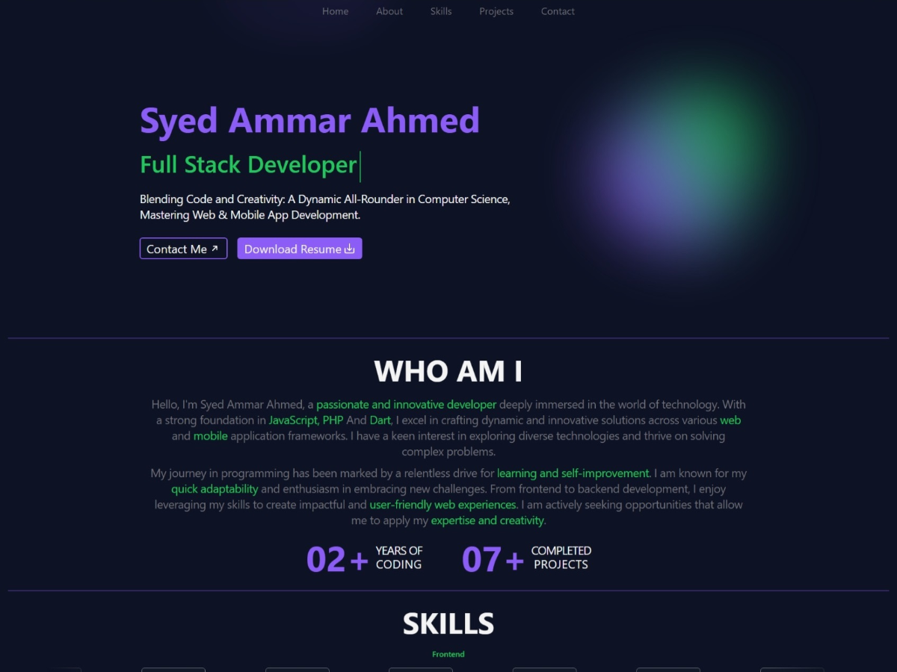

# SAA Web Developer Portfolio WordPress Theme

This is a professional and modern serverless WordPress theme tailored for web developers to showcase their portfolio and skills. It features a clean, responsive design, ensuring an optimal viewing experience across devices. With easy customization options, this theme allows you to present your work, highlight your expertise, and offer potential clients a seamless browsing experience without the need for a traditional server setup.

---

## Table of Contents

- [Key Features](#key-features)
- [Screenshots](#screenshots)
- [Installation](#installation)
- [Customization](#customization)
- [How to Use](#how-to-use)
  - [Portfolio Section](#portfolio-section)
  - [Skills Section](#skills-section)
  - [Video Tutorial](#video-tutorial)
- [Credit](#credit)
- [Support](#support)
- [Contribution Guidelines](#contribution-guidelines)
- [Star the Repository](#star-the-repository)
- [Support the Project](#support-the-project)
- [License](#license)

---

## Key Features

- **Clean & Modern Design**: A sleek, user-friendly layout designed for professional portfolios.
- **Responsive Layout**: Fully optimized for mobile, tablet, and desktop devices.
- **Serverless Architecture**: No need for complex server setups—leverage WordPress's built-in features for hosting.
- **Easy to Use**: Designed with simplicity in mind, allowing you to quickly set up and customize the theme.
- **Quick Application**: Apply changes easily through the WordPress Customizer without touching any code.
- **Portfolio Section**: Display your projects, including descriptions and external links.
- **Skills Section**: Showcase your technical expertise with logos and descriptions.
- **Contact Form**: Enable clients to reach out directly from your site.
- **SEO-Friendly**: Structured to improve visibility on search engines.
- **Cross-Browser Compatibility**: Works seamlessly across major browsers.
- **Lightweight & Fast**: Optimized for performance, ensuring fast loading times.
- **Regular Updates**: Ongoing support and improvements to keep the theme up to date.

---

## Screenshots

---

## Installation

1. Download the theme from the [GitHub repository](https://github.com/ammarsaa/web-developer-portfolio-wordpress-theme).
2. Extract the downloaded `.zip` file.
3. Upload the extracted folder to your WordPress theme directory (`/wp-content/themes/`).
4. Log in to your WordPress admin panel.
5. Navigate to **Appearance > Themes**.
6. Locate the **SAA Web Developer Portfolio** theme and click **Activate**.

---

## Customization

1. Log in to your WordPress admin panel.
2. Go to **Appearance > Themes > Customize**.
3. Modify the theme settings to suit your preferences, such as colors, fonts, and layout options.
4. Once you're satisfied, click **Save & Publish** to apply the changes to your live site.

---

## How to Use

### Portfolio Section

To add projects to the portfolio section:

1. Log in to your WordPress admin panel.
2. Go to **Appearance > Themes > Customize > Portfolio**.
3. Click **Add New Project**.
4. Provide a project title, description, and featured image.
5. Add links to the GitHub repository and live project (if applicable).
6. Click **Publish** to make the project live.

### Skills Section

To add skills to the skills section:

1. Log in to your WordPress admin panel.
2. Navigate to **Appearance > Themes > Customize > Skills**.
3. Add a new skill by entering its name and uploading a corresponding logo.
4. Organize skills under categories like Frontend, Backend, or Tools for better structure.
5. Click **Publish** to display the skill on your website.

### Video Tutorial

A step-by-step video tutorial is coming soon! Stay tuned for a comprehensive walkthrough on how to set up and customize the theme.

---

## Credit

This theme is based on the original Next.js website created by [Rahul](https://github.com/programmer-rahul/personal-portfolio).

---

## Support

If you encounter any issues or have questions about the SAA Web Developer Portfolio theme, please create an issue on the [GitHub repository](https://github.com/ammarsaa/web-developer-portfolio-wordpress-theme/issues).

---

## Contribution Guidelines

We welcome contributions to enhance the theme. Here's how you can contribute:

1. Fork the repository from [GitHub](https://github.com/ammarsaa/web-developer-portfolio-wordpress-theme).
2. Create a new branch for your feature or bug fix.
3. Implement your changes and test them thoroughly.
4. Commit your changes with clear and descriptive messages.
5. Push your branch to your forked repository.
6. Open a pull request, providing a detailed description of your changes.
7. The maintainers will review your pull request and provide feedback.

---

## Star the Repository

If you find this theme useful, please consider giving the project a ⭐ on [GitHub](https://github.com/ammarsaa/web-developer-portfolio-wordpress-theme). Your support helps improve the theme and encourages future development!

---

## Support the Project

If you'd like to support further development of this theme, you can [buy me a coffee](https://www.buymeacoffee.com/ammarsaa). Your support is greatly appreciated!

---

## License

This theme is licensed under the [MIT License](https://opensource.org/licenses/MIT). You are free to use, modify, and distribute the theme under the terms of this license.

---

Thank you for using the **SAA Web Developer Portfolio WordPress Theme**! We hope this theme helps you showcase your projects and skills effectively. Happy coding!
